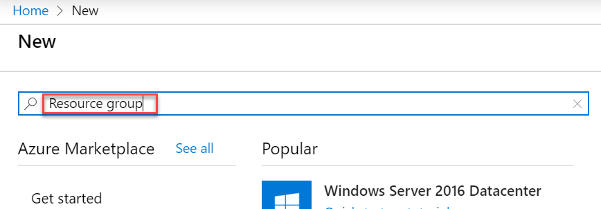
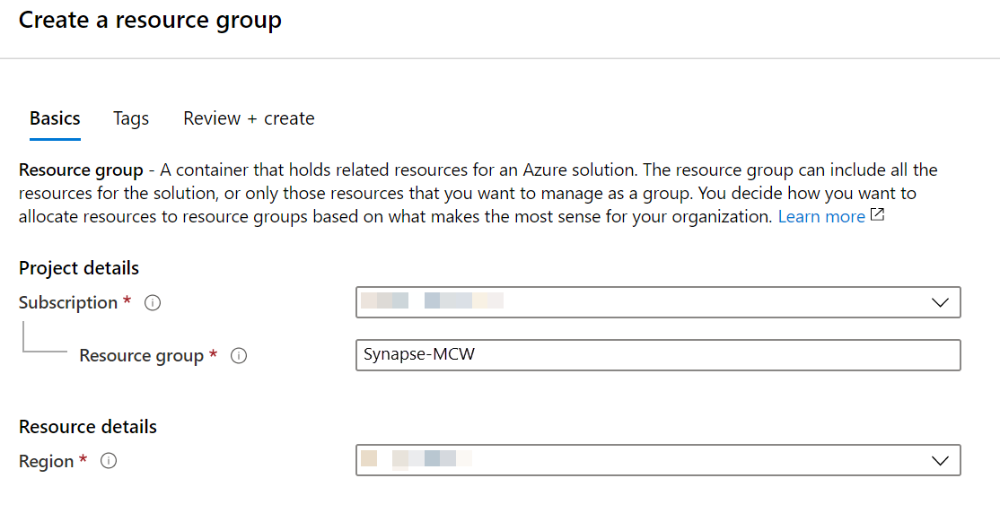
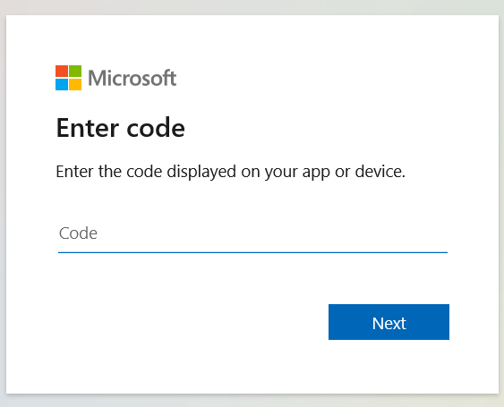

<div class="MCWHeader1">
Azure Synapse Analytics and AI
</div>

<div class="MCWHeader2">
Before the hands-on lab setup guide
</div>

<div class="MCWHeader3">
May 2020
</div>


Information in this document, including URL and other Internet Web site references, is subject to change without notice. Unless otherwise noted, the example companies, organizations, products, domain names, e-mail addresses, logos, people, places, and events depicted herein are fictitious, and no association with any real company, organization, product, domain name, e-mail address, logo, person, place or event is intended or should be inferred. Complying with all applicable copyright laws is the responsibility of the user. Without limiting the rights under copyright, no part of this document may be reproduced, stored in or introduced into a retrieval system, or transmitted in any form or by any means (electronic, mechanical, photocopying, recording, or otherwise), or for any purpose, without the express written permission of Microsoft Corporation.

Microsoft may have patents, patent applications, trademarks, copyrights, or other intellectual property rights covering subject matter in this document. Except as expressly provided in any written license agreement from Microsoft, the furnishing of this document does not give you any license to these patents, trademarks, copyrights, or other intellectual property.

The names of manufacturers, products, or URLs are provided for informational purposes only and Microsoft makes no representations and warranties, either expressed, implied, or statutory, regarding these manufacturers or the use of the products with any Microsoft technologies. The inclusion of a manufacturer or product does not imply endorsement of Microsoft of the manufacturer or product. Links may be provided to third party sites. Such sites are not under the control of Microsoft and Microsoft is not responsible for the contents of any linked site or any link contained in a linked site, or any changes or updates to such sites. Microsoft is not responsible for webcasting or any other form of transmission received from any linked site. Microsoft is providing these links to you only as a convenience, and the inclusion of any link does not imply endorsement of Microsoft of the site or the products contained therein.

© 2020 Microsoft Corporation. All rights reserved.

Microsoft and the trademarks listed at <https://www.microsoft.com/en-us/legal/intellectualproperty/Trademarks/Usage/General.aspx> are trademarks of the Microsoft group of companies. All other trademarks are property of their respective owners.

**Contents**

<!-- TOC -->

- [Azure Synapse Analytics and AI before the hands-on lab setup guide](#azure-synapse-analytics-and-ai-before-the-hands-on-lab-setup-guide)
  - [Requirements](#requirements)
  - [Before the hands-on lab](#before-the-hands-on-lab)
    - [Task 1: Create a resource group in Azure](#task-1-create-a-resource-group-in-azure)
    - [Task 2: Create the Azure Synapse Analytics workspace](#task-2-create-the-azure-synapse-analytics-workspace)
    - [Task 3: Download lab artifacts](#task-3-download-lab-artifacts)
    - [Task 4: Establish a user context](#task-4-establish-a-user-context)
    - [Task 4: Run environment setup PowerShell script](#task-4-run-environment-setup-powershell-script)

<!-- /TOC -->

# Azure Synapse Analytics and AI before the hands-on lab setup guide

## Requirements

1. An Azure Account with the ability to create an Azure Synapse Workspace

## Before the hands-on lab

**Duration**: 20 minutes

### Task 1: Create a resource group in Azure

1. Log into the [Azure Portal](https://portal.azure.com) using your Azure credentials.

2. On the Azure Portal home screen, select the **+ Create a resource** tile.

    

3. In the **Search the Marketplace** text box, type **Resource group** and press the **Enter** key.

    

4. Select the **Create** button on the **Resource group** overview page.

5. On the **Create a resource group** screen, select your desired Subscription and Region. For Resource group, enter **Synapse-MCW**, then select the **Review + Create** button.

    

6. Select the **Create** button once validation has passed.

### Task 2: Create the Azure Synapse Analytics workspace

1. Deploy the workspace through the following Azure ARM template (press the button below):

    <a href="https://portal.azure.com/#create/Microsoft.Template/uri/https%3A%2F%2Fraw.githubusercontent.com%2Fmicrosoft%2FMCW-Azure-Synapse-Analytics-and-AI%2Fmaster%2FHands-on%2520lab%2Fenvironment-setup%2Fautomation%2F00-asa-workspace-core.json" target="_blank"></a>

2. On the **Custom deployment** form, select your desired subscription and select **Synapse-MCW** for the **Resource group**. Also provide a **Unique Suffix** such as your initials followed by birth year. Finally, provide a strong **SQL Administrator Login Password**. Remember this password value, you'll be needing it!

    
  
3. Check the **I agree to the terms and conditions stated above**, then select the **Purchase** button.

    > **Note**: You may experience a deployment step failing in regards to Role Assignment. This error may safely be ignored.

### Task 3: Download lab artifacts

1. In the Azure Portal, open the Azure Cloud Shell by selecting its icon from the right side of the top toolbar.

    

    > **Note**: If you are prompted to create a storage account for the Cloud Shell, agree to have it created.

2. In the Cloud Shell window, enter the following command to clone the repository files.

    ```PowerShell
    git clone https://github.com/microsoft/MCW-Azure-Synapse-Analytics-and-AI.git Synapse-MCW
    ```

3. Keep the Cloud Shell open.

### Task 4: Establish a user context

1. In the Cloud Shell, execute the following command:

    ```cli
    az login
    ```

2. A message will be displayed asking you to open a new tab in your web browser, navigate to [https://microsoft.com/devicelogin](https://microsoft.com/devicelogin) and to enter a code for authentication.

   

   

3. Once complete, you may close the tab from the previous step and return to the Cloud Shell.

### Task 4: Run environment setup PowerShell script

When executing the script below, it is important to let the scripts run to completion. Some tasks may take longer than others to run. When a script completes execution, you will be returned to a command prompt.

1. In the Cloud Shell, change the current directory to the **automation** folder of the cloned repository by executing the following:

    ```PowerShell
    cd './Synapse-MCW/Hands-on lab/environment-setup/automation'
    ```

2. Execute the **01-environment-setup.ps1** script by executing the following command:

    ```PowerShell
    ./01-environment-setup.ps1
    ```

    You will be prompted to enter the name of your desired Azure Subscription. You can copy and paste the value from the list to select one. You will also be prompted for the following information for this script:

    | Prompt |
    |--------|
    | Enter the desired Azure Subscription for this lab [you will be able to copy and paste from a listing] |
    | Enter the name of the resource group containing the Azure Synapse Analytics Workspace |
    | Enter the SQL Administrator password you used in the deployment |
    | Enter the unique suffix you used in the deployment |

    

3. At the end of the script, you should see a message indicating **Environment validation has succeeded**.

You should follow all steps provided *before* performing the Hands-on lab.
